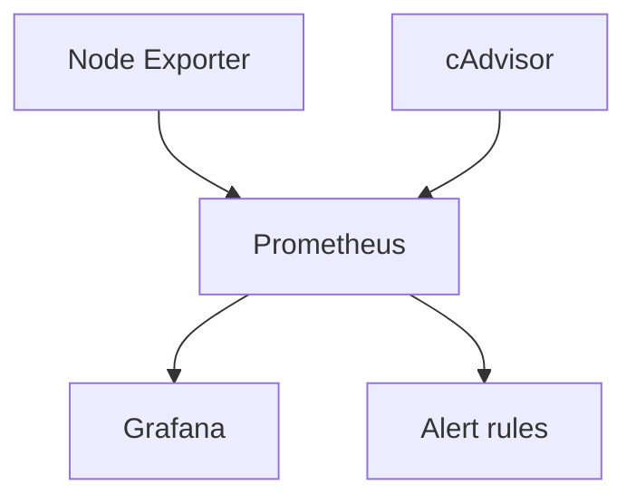

# Monitoring Stack: Prometheus + Grafana + Alerting

**Stack skills:** `Prometheus · Grafana · Docker · Linux`

> Full portfolio stack: Linux · Docker · Kubernetes · Jenkins · GitLab CI · Ansible · Terraform · Prometheus · Grafana · Zabbix · Nginx · Git · Python · Bash · PowerShell
>
> Hub: https://github.com/qwertqaze102-prog/devops-portfolio-hub


## Architecture



```text
Exporters → Prometheus → Grafana dashboards
                 ↘ Alert rules (InstanceDown / HighCPU)
```

Observability lab for portfolio:
- Prometheus scrapes node-exporter and cAdvisor
- Grafana with provisioned datasource
- Alert rules for instance down / high CPU

## Start
```bash
docker compose up -d
open http://localhost:3000   # admin / admin_change_me
open http://localhost:9090   # Prometheus
```

## Skills shown
metrics, dashboards, alert design, container observability

## Screenshots / how it looks

> Diagrams above show architecture. Run the stack locally and attach UI screenshots here if needed:
> - `docs/screenshots/` folder (optional)
> - keep secrets out of screenshots
